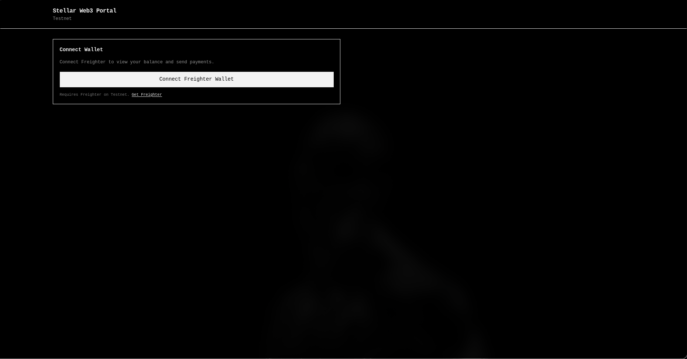
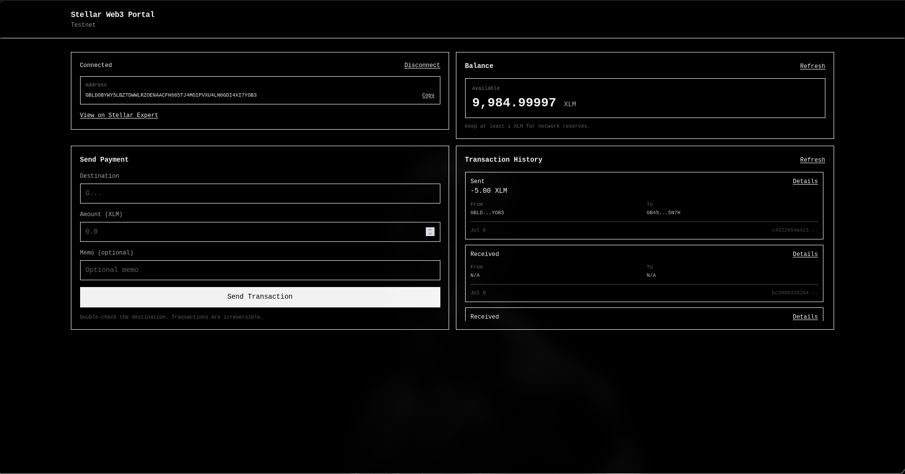

# Stellar Level 1 DApp: Wallet Portal

Decentralized application on the **Stellar Testnet** using **Next.js (App Router)**, **React (TypeScript)**, the official **Stellar SDK**, and the **Freighter Wallet API**.

---

## Project structure

```
risein-whitebelt/
├── app/
│   ├── globals.css
│   ├── layout.tsx
│   └── page.tsx
├── components/
│   ├── BalanceDisplay.tsx
│   ├── BonusFeatures.tsx
│   ├── PaymentForm.tsx
│   ├── TransactionHistory.tsx
│   ├── WalletConnection.tsx
│   └── example-components.tsx
├── lib/
│   └── stellar-helper.ts
└── package.json
```

---

## Features

* **Active Access Handshake** — `requestAccess()` opens an explicit Freighter popup
* **Reactive Dynamic Fee Estimation** — uses Horizon `feeStats()` mode fee
* **Intelligent Operation Splitting** — `Operation.createAccount` when the destination is unfunded
* **Balance Display** — live XLM (and other assets) from Horizon
* **Transaction History** — recent payments with Stellar Expert links

---

## Setup

### Prerequisites

* Node.js 18+
* [Freighter](https://freighter.app) extension set to **Testnet**

### Install & run

```bash
cd risein-whitebelt
npm install
npm run dev
```

Open [http://localhost:3000](http://localhost:3000).

### Scripts

| Command | Description |
|---------|-------------|
| `npm run dev` | Start Next.js development server |
| `npm run build` | Production build |
| `npm start` | Serve production build |

---

## Application states

### A. Wallet Connected



### B. Balance Displayed

